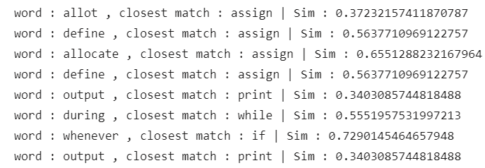

# NLP-based Automatic Translation Application: Pseudocode to C

This is a Compiler Design project that uses pseudocode and augments it with Natural Language Processing to allow users to use more keywords based on their preference. 
It is built using pure python implementation of Lex and Yacc by using SLY.

start
assign ( num int )
assign ( c int )
allot ( i int )
define ( flag int )
assign flag to 0
display "Enter the value to be checked "
read (num int)
for i from 2 to num
repetition
c = num%i
if c==0
then
assign flag to 1
endif
endfor
if flag==1
then
print "The value "
print (num int)
print " is not prime"
else
print "The value "
print (num int)
print " is prime"
endif
end

It produces the C code as the following

#include<stdio.h>

void main()
{
    int num;
    int c;
    int i;
    int flag;
    flag=0;
    printf("Enter the value to be checked ");
    scanf("%d",&num);
    for(i = 2 ; i <= num ; i++)
    {
        c = num%i;
        if(c == 0)
        {
            flag=1;
        }
    }
    if(flag == 1)
    {
        printf("The value ");
        printf("%d",num);
        printf(" is not prime");
    }
    else
    {
        printf("The value ");
        printf("%d",num);
        printf(" is prime");
    }
}
## NLP techniques used
Pseudocode can vary between users, and to incorporate Natural Language and make translation easier, we make use of Similarity metrics. We use the Spacy module to check Similarity.
Our model uses a very limited set of keywords to demonstrate the basic functionality.
A user is free to use other words that correspond to a similar meaning to a word present in the dictionary, and it is then automatically mapped to perform the same functionality as illustrated below:

## Key Features
- 🔍 **Natural Language Parsing** with SpaCy to recognize user-defined variations (e.g., "allot" → "assign")
- 📥 **Pseudocode Input Interface** via Streamlit
- 🧾 **SLY-based Lexical & Syntax Analysis** (custom lexer & parser)
- ⚠️ **Error Feedback**:
  - Undeclared variable detection
  - Syntax issues
- 🎯 **C Code Generation**
- 🎨 **Automatic C Code Formatting** with AStyle

## Tech Stack
- **Python 3.10+**
- **SLY** (Lex-Yacc implementation)
- **SpaCy** (with `en_core_web_lg` model)
- **Streamlit** (for GUI)
- **AStyle** (for clean C code formatting)
- **NLTK** & **Pandas** (for tokenization and NLP utilities)

## 📦 Installation

1. **Clone the repository**:
-git clone https://github.com/yourusername/cd-project-smart-pseudocode-to-c.git
-cd cd-project-smart-pseudocode-to-c

2.**Create Virtual Environment**
-python -m venv venv
-venv\Scripts\activate  # On Windows

3. **Install Dependencies**
-pip install -r requirements.txt
-python -m spacy download en_core_web_lg

4.**Usage**
-python test_input.py
-streamlit run app.py

## Ideal For:
- Programming beginners
- Students learning compiler design
